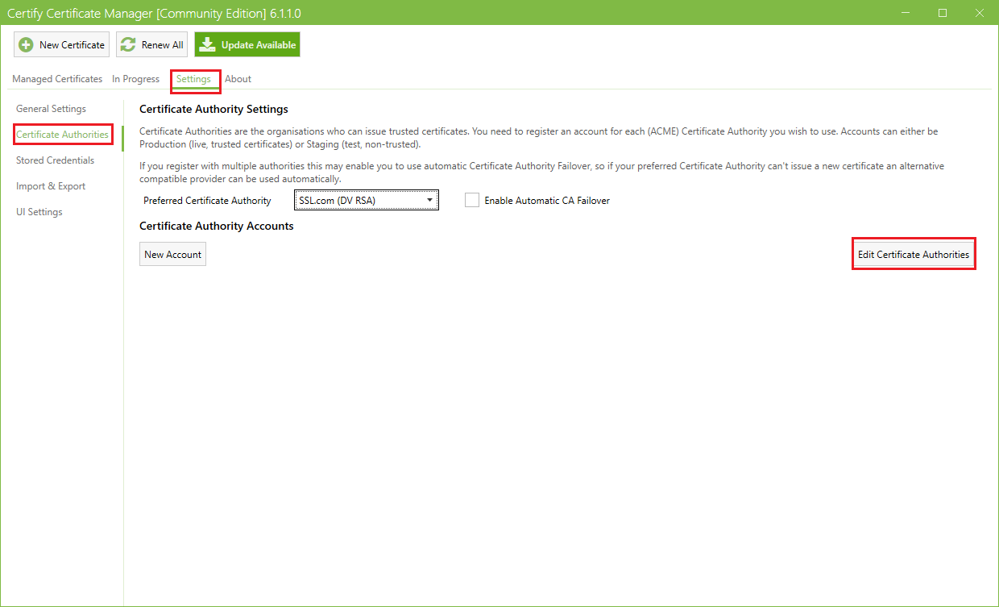
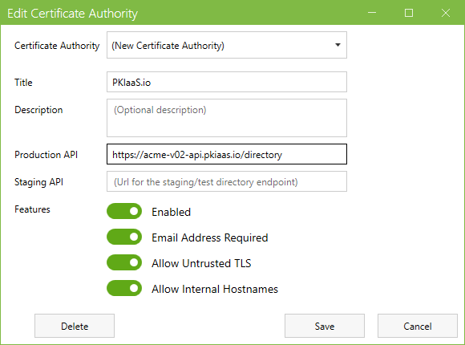
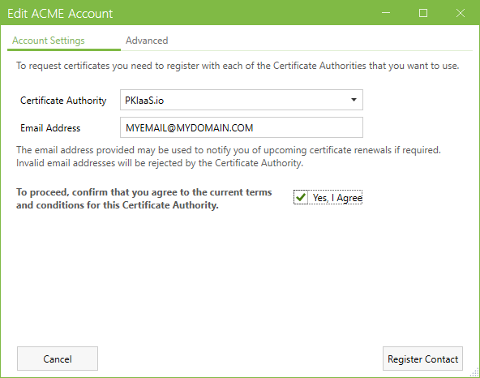
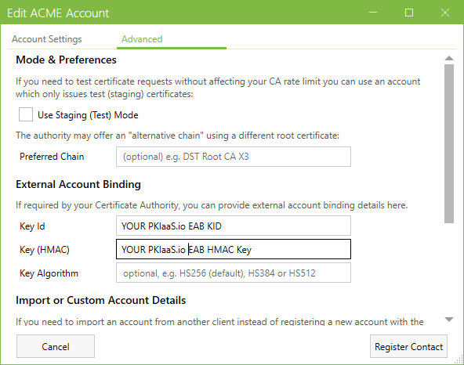
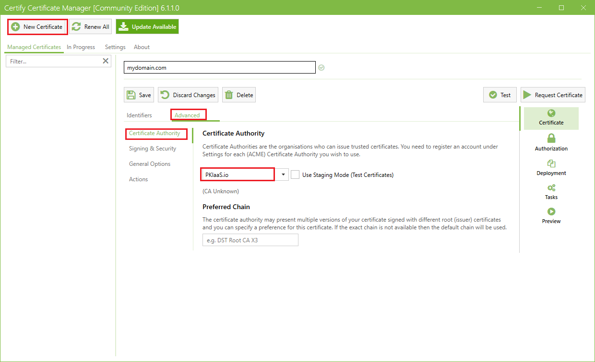

Be sure to have the EAB KID and HMAC Key ready for the steps below. See [Generate EAB Credentials](../generate-eab-credentials.md) for more information.

1. Download Certify the Web from [https://certifytheweb.com/](https://certifytheweb.com/) and install it.
2. Launch Certify the Web and click the **Settings** tab near the top of the window and then **Certificate Authorities** on the left.  

3. Click **Edit Certificate Authorities**.
    * In the **Certificate Authority** field, leave "(New Certificate Authority)" selected.
    * In the **Title** field, enter "PKIaaS.io" or something else to uniquely identify the new CA.
    * In the **Production API** field, enter the PKIaaS.io ACME directory URL "https://acme-v02-api.pkiaas.io/directory".
    * Optionally enter a **Description**. The **Staging API** field may be left blank.
    * Enable all of the options under **Features**
    * Click **Save**  
    
4. Click the **New Account** button on the far left of the Edit Certificate Authorities button clicked in step 3.
    * From the **Certificate Authority** dropdown, select the CA title that was entered in step 5.
    * Enter the **Email Address** to be associated with the new ACME account.
    * Check **Yes, I Agree** to agree to the terms and conditions for the CA.
    
5. Click **Advanced** to enter the EAB credentials.
    * Enter the **Key Id** and **Key (HMAC)** using the "EAB KID" and "EAB HMAC Key" provided when generating the EAB credentials.
    * Click **Register Contact**.
    
6. The ACME account is now registered and ready to requests certificates from PKIaaS.io. Be sure to select the new CA created in step 3 when creating a new certificate request.  

See Certify the Web's [Certificate Manager Documentation](https://docs.certifytheweb.com/docs/intro) for more information about Certify The Web.