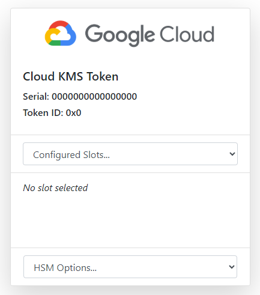

### Log in to the Google Cloud Console
Navigate to the [Google Cloud Console](https://console.cloud.google.com/){:target="_blank"}, and log in with your Google account.

### Create a New Project and Add a Billing Account
If you haven't already, create a new project to contain the KMS key(s) that will be used with IoT-HSM. After the project is created, use the navigation menu at the top left to choose "Billing" and add a billing account.

### Enable Required APIs
In the Google Cloud Console using the navigation menu at the top left, go to "APIs & Services" > "Enable APIs and Services". Ensure the following APIs are enabled for the project:

- Cloud Key Management Service (KMS) API
- Cloud Resource Manager API

### Create a Key
In the Google Cloud Console, use the navigation menu to go to "Security" > "Key Management". Click on "Create key ring" to create a new key ring. Navigate to the new key ring and click "Create key" to create a new key within the key ring. Use the following options when creating keys:

- **Key name**: *Key names may contain letters, numbers, underscores, and hyphens. They must be unique within the key ring and cannot be renamed or deleted.*
- **Protection Level**: HSM
- **Key material**: HSM-generated key
- **Purpose**: Asymmetric sign
- **Algorithm**: *Supported algorithms*
    - Elliptic Curve P-256 - SHA256 Digest
    - Elliptic Curve P-384 - SHA384 Digest
    - Elliptic Curve P-521 - SHA512 Digest
    - 2048 bit RSA - PKCS#1 v1.5 padding - SHA256 Digest
    - 3072 bit RSA - PKCS#1 v1.5 padding - SHA256 Digest
    - 4096 bit RSA - PKCS#1 v1.5 padding - SHA256 Digest
    - 4096 bit RSA - PKCS#1 v1.5 padding - SHA512 Digest
- **Key rotation**: *Not available for asymmetric keys*
- **Duration of 'scheduled destruction' state**: *The number of days for which a key version remains in the "Scheduled for destruction" state after a request to destroy is submitted. During this time, users can restore the key. The value cannot be changed once the key is created. Default is 30 days*

### Create a Service Account
In the Google Cloud Console, use the navigation menu to go to "IAM & Admin" > "Service Accounts". Click "Create service account" and provide a name, service account ID, and optionally a description for the service account. After creating the service account, assign it the following roles:

- Cloud KMS Crypto Operator
- Cloud KMS CryptoKey Signer/Verifier
- Cloud KMS Viewer

If roles for the service account need to be updated, they can be managed by selecting the service account and then navigating to "Permissions" and clicking "Manage Access".

**If IoT-HSM has been deployed as a VM or container on GCP, it can use the default service account associated with the VM or container for authentication. In this case, no service account key is needed. This is highly recommended as it simplifies the authentication process and reduces the risk of key exposure. Be sure to enable the "Cloud Platform" API within the access scope configuration on the VM. All documentation regarding service account keys are not applicable in this scenario.**

### Create Service Account Key
Select the service account you created earlier, then click "Keys" and "Add Key" to create a new key. Choose the JSON key type and click "Create". The key file will be downloaded automatically. Store this file securely, as it contains the credentials needed to authenticate as the service account.

### Upload Service Account Key
Log into the IoT-HSM management interface and navigate to "Configure Google KMS". Upload the service account key file you downloaded earlier and click "Test Authentication". If authentication is successful, you will see the project and location fields populated with options to select. To select the appropriate key ring, choose the project and location it was created in. Finally, select the key ring to connect to the IoT-HSM and click "Check Permissions and Save".

Navigate to the IoT-HSM home page using the link at the top left and you should see a new "Cloud KMS Token".

Next, see the [configuration documentation](configuration.md) to continue configuring Google Cloud KMS with IoT-HSM.