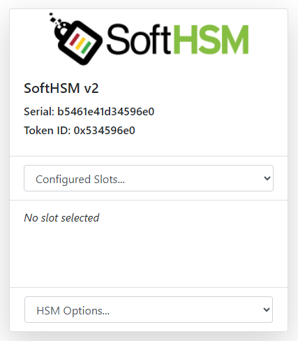

### Create a SoftHSM2 HSM
All that is required to create a SoftHSM2 slot is to navigate to the IoT-HSM in a browser and click "Create SoftHSM2" in the top left of the navigation bar. SoftHSM2 is a software-based HSM that provides a virtual device for cryptographic operations. It should be used only for testing IoT-HSM and is not intended for production use.

Next, see the [configuration documentation](configuration.md) to continue configuring SoftHSM2 with IoT-HSM.