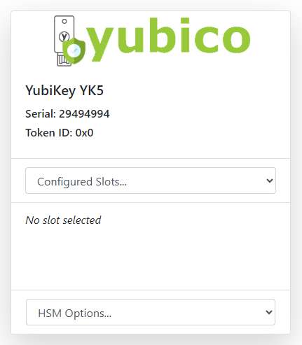

### Insert the YubiKey into the IoT-HSM Appliance
All that is required to use a YubiKey as an HSM with IoT-HSM is to plug it into the appliance. Next, login to the IoT-HSM. If you don't see the YubiKey listed on the main IoT-HSM page like the image below, use the reload button in the top navigation bar to refresh the list of connected devices.

Next, see the [configuration documentation](configuration.md) to continue configuring the YubiKey with IoT-HSM.