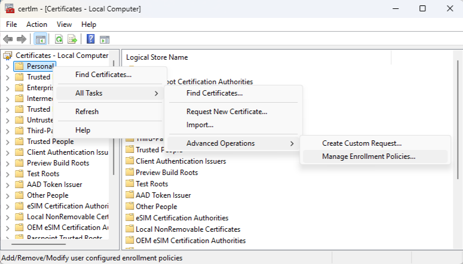
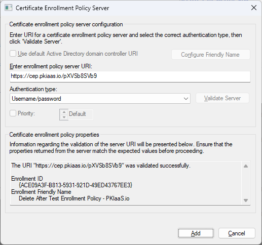

Before adding an enrollment policy and configuring Windows to request certificates from PKIaaS.io, CEP and CEP must be enabled on your CA and templates. See [Enabling Windows Integration](overview.md/#enabling-windows-integration) if this step hasn't been completed yet.

## Client Configuration
To configure Windows clients for certificate issuance and renewal with PKIaaS.io, follow these steps:

1. **Install the Root CA Certificate**: Download the root CA certificate from PKIaaS.io and install it on the Windows client. This is necessary to trust the certificates issued by PKIaaS.io. The root CA certificate can be downloaded by navigating to **Certificate Authorities -> Manage CAs** in the navigation pane on the left side of the page. Click on the CA you want to download, and select **Get CA Certificate(s)**. A download option is available beneath the "Certificate" tab. Import the certificate into the "Trusted Root Certification Authorities" store on the Windows client.
2. **Configure Certificate Enrollment Policy**: 

    * Use the command certmgr.msc (for user certificates) or certlm.msc (for machine certificates) to open the Certificate Manager. Right-click on "Personal" and select "All Tasks -> Advanced Operations -> Manage Enrollment Policies...". This will open the Certificate Enrollment wizard. Click "Next" to proceed.

    

    * Click "Add" to add a new enrollment policy server. Enter the URL of the PKIaaS.io CEP service. The URL can be found by navigating to **Certificate Authorities -> Manage CAs** in the navigation pane on the left side of the page. Click on a CA, and select **Show CA Service URLs**. Use the "CEP (User/Pass)" or "CEP (Cert Auth)" URL, depending on the authentication method you want to use. Select "Username/password" or "X.509 Certificate" as the authentication type, based on the desired configuration and the URL supplied and click "Validate Server". You will be prompted to enter the username and password for the CEP service. If you are using X.509 Certificate authentication, you will need to select the certificate to use for authentication. Click "Add" to save the enrollment policy server.

    