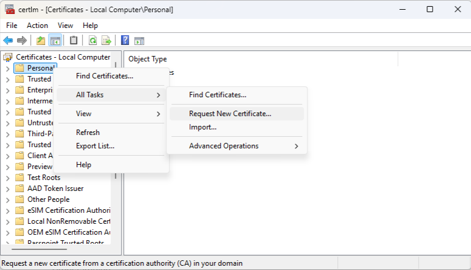
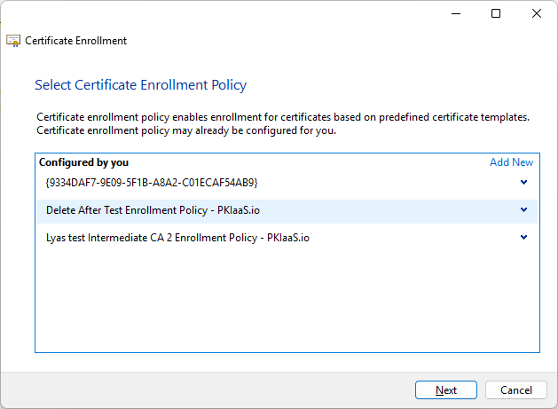
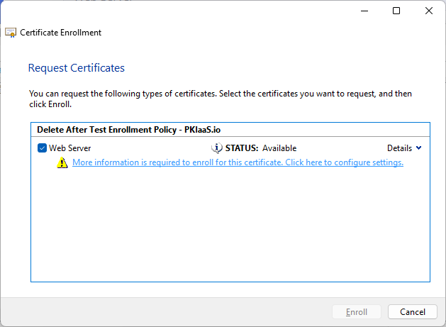
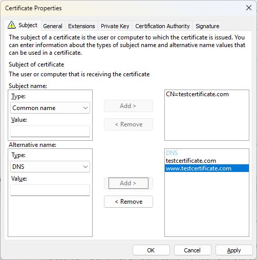
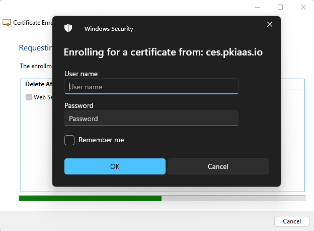

Before requesting certificates using the PKIaaS.io native Windows integration, an enrollment policy must be added to the Windows client. See [Add Enrollment Policy](add-enrollment-policy.md) if this step hasn't been completed yet.

1. Use the command certmgr.msc (for user certificates) or certlm.msc (for machine certificates) to open the Certificate Manager. Right-click on "Personal" and select "All Tasks -> Advanced Operations -> Manage Enrollment Policies...". This will open the Certificate Enrollment wizard.  

2. Click "Next" to continue, select the enrollment policy server that was added previously. You may be prompted to enter the username and password for the CEP service if you are using Username/Password authentication. If you are using X.509 Certificate authentication, select the certificate to use for authentication.  

3. A list of CES enabled certificate templates will be displayed. If the template you want to use is not listed, ensure that the template is CES enabled and that it is configured with the correct template type (Computer or User) for the certificate you want to request. Select the template you want to use and click "Next".  
  
**Note:** If a template was added or modified recently, it may take up to an hour for the changes to propagate to the Windows client due to caching. For immediate access to the new or modified template, the enrollment policy must be removed and re-added on the Windows client.
4. Click the warning link beneath the template "More information is required to enroll for this certificate. Click here to configure settings." This will open the certificate properties dialog where you can configure the certificate request settings including subject attributes, subject alternative names (SANs), and cryptographic options. The options available will depend on the template configuration. Once you have configured the settings, click "OK" to close the dialog.  

5. Finally, click "Enroll" to request the certificate. The certificate will be requested from the PKIaaS.io CES service using the selected template and the configured settings. Unless it is cached from a previous request, you will be prompted to enter the username and password associated with the template for the CES service. If the request is successful, the certificate will be issued and added to the "Personal" store in the Certificate Manager.
